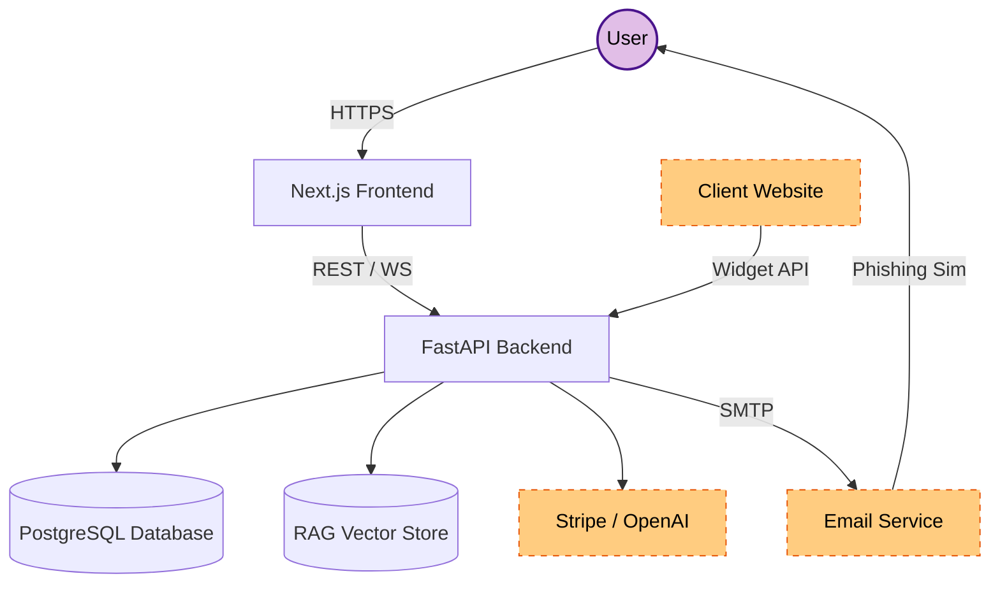
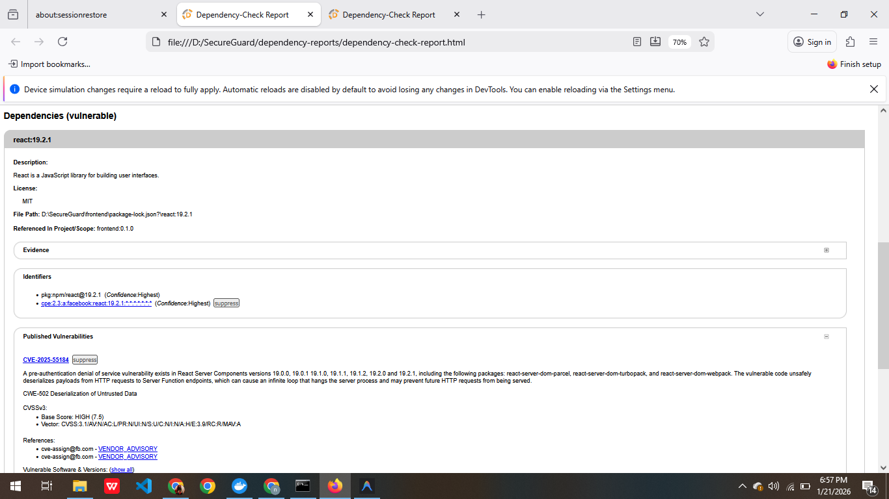
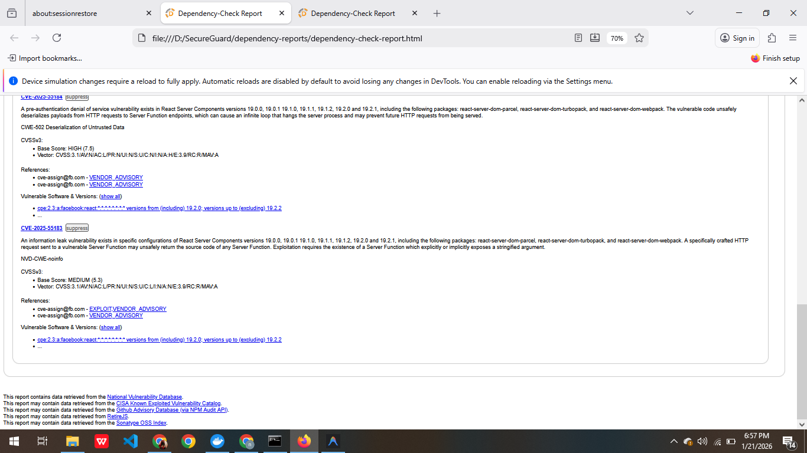
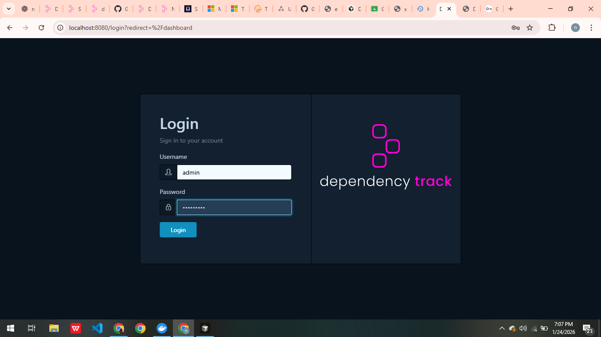
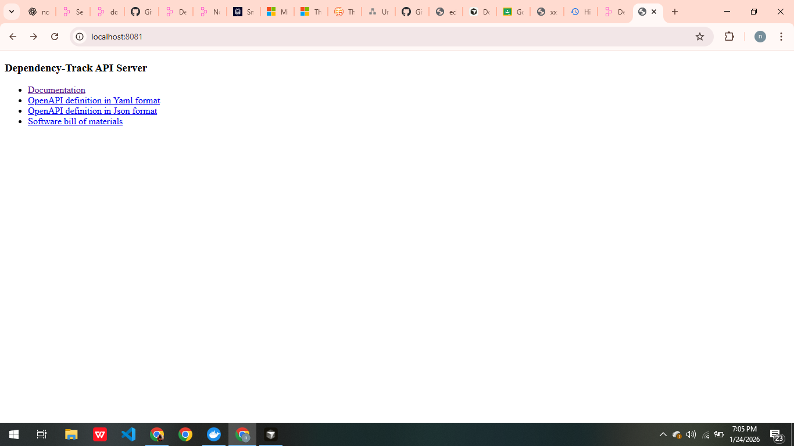
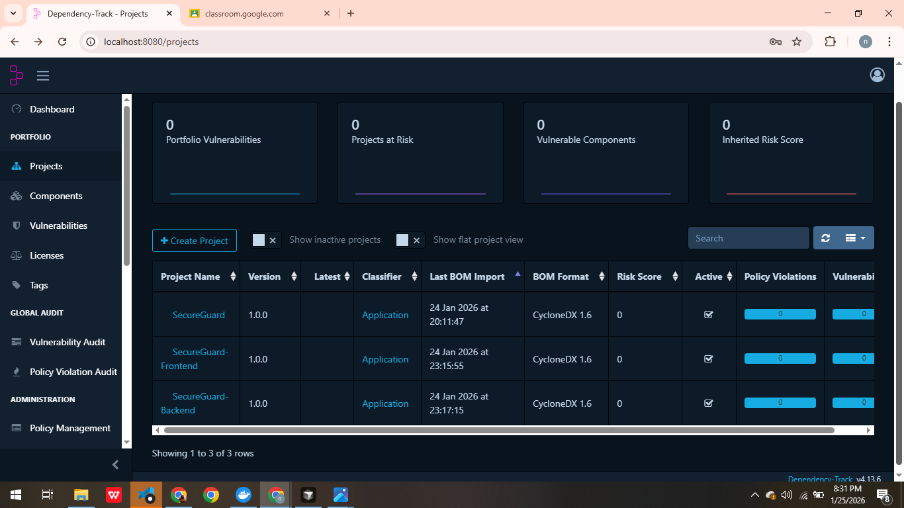
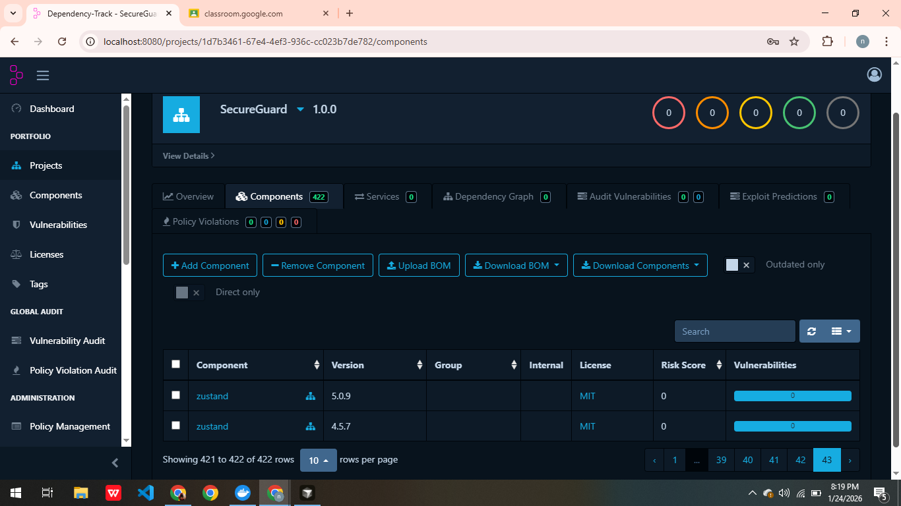

# SecureGuard AI – Next-Gen Cybersecurity SaaS 🛡️

SecureGuard AI is a high-performance, premium-grade SaaS platform designed to protect organizations from modern cyber threats. It features **real-time phishing defense**, a **unified security scanner**, a **RAG-powered AI Security Assistant**, and **interactive awareness training**.


---

## 🚀 Quick Start (Step-by-Step)

The fastest way to get SecureGuard running is using Docker. This starts the Frontend, Backend, and PostgreSQL database with a single command.


### 1. Prerequisites
- [Docker](https://www.docker.com/products/docker-desktop/) installed and running.
- [Git](https://git-scm.com/) installed.

### 2. Setup Guide
1.  **Clone the Repository**
    ```bash
    git clone https://github.com/NoorAhmed786/SecureGuard.git
    cd SecureGuard
    ```

2.  **Configure Environment**
    Copy the example environment file and customize it if needed (optional for local testing).
    ```bash
    cp .env.example .env
    ```

3.  **Launch the Application**
    ```bash
    docker-compose up --build
    ```

### 3. Access the Services
- **Frontend Dashboard**: [http://localhost:3000](http://localhost:3000)
- **API Documentation**: [http://localhost:8000/docs](http://localhost:8000/docs)

---

## 📸 Platform Showcase

### 🛡️ Dashboard & Security Scanner
A premium dashboard providing real-time metrics and a unified engine to analyze suspicious emails and websites.


### 🤖 AI Security Assistant (RAG)
An intelligent security companion that answers technical questions and analyzes threats using a proprietary knowledge base.


### 🚨 Real-time Alerts
Instant threat notifications ensure you never miss a critical security event.


### 👑 Admin Panel
A comprehensive administrative panel for managing users, API keys, and system settings.


---

## 🏗️ Architecture & Security

### High-Level Design
SecureGuard follows a **Layered Clean Architecture** to ensure scalability and security.

For a detailed breakdown of data flows and trust boundaries, see the [Data Flow Diagram (DFD)](threat_model/data_flow_diagram.md).



### 🛡️ Security & Code Quality
The project is continuously monitored by **SonarCloud** for vulnerabilities and code smells.

[](https://sonarcloud.io/dashboard?id=NoorAhmed786_SecureGuard)

- 📊 **[Live SonarCloud Report](https://sonarcloud.io/dashboard?id=NoorAhmed786_SecureGuard)**

    **Issues Before Resolution:**
    

- 🔒 **Zero-Secrets Policy**: Sensitive data is excluded via `.dockerignore` and `.gitignore`.
- 🔐 **Hardened Dockerfiles**: Optimized for security and minimal attack surface.
- 📦 **Automated Dependency Scanning**: Dependencies are vetted for vulnerabilities using OWASP Dependency Check (HTML reports available in Actions artifacts).

    **Before Resolution:**
    
    
    

    **After Resolution:**
    

---

### 🛡️ Manual Security Verification

#### Dependency-Check (OWASP)

This project uses **OWASP Dependency-Check** to identify any known vulnerabilities in the dependencies used by the application. Here's how you can run the Dependency-Check tool to generate a report.

**Requirements:**
- Java 8 or higher must be installed on your machine.
- Download and install [OWASP Dependency-Check](https://owasp.org/www-project-dependency-check/).

**Steps to Run Dependency-Check:**
1. **Navigate to the project directory**:
    ```bash
    cd path/to/your/project
    ```

2. **Run the Dependency-Check**:
    ```bash
    dependency-check --project "SecureGuard" --scan D:\SecureGuard --out D:\SecureGuard\dependency-reports --format HTML --noupdate
    ```

3. After running the above command, a report will be generated at `D:\SecureGuard\dependency-reports` (or the directory you specified).

**Explanation of the Command:**
- `--project "SecureGuard"`: Defines the name of your project.
- `--scan D:\SecureGuard`: Specifies the directory to scan (your project directory in this case).
- `--out D:\SecureGuard\dependency-reports`: Specifies where to save the generated report.
- `--format HTML`: Generates the report in HTML format.
- `--noupdate`: Skips the NVD database update process (useful if you're facing issues with the update).

#### CI/CD Security Configuration

To ensure a secure and reliable automated dependency check, the GitHub Actions workflow was configured with the following security measures:

1.  **Official Action Standardization**: Replaced legacy manual download scripts with the official **[OWASP Dependency-Check Action](https://github.com/dependency-check/Dependency-Check_Action)**. This ensures access to the latest features and vulnerability definitions.
2.  **Supply Chain Hardening**: The action is pinned to a specific immutable commit SHA (`1e54355...`) instead of a mutable tag like `@main`. This prevents potential supply chain attacks where a malicious actor could overwrite a tag to inject harmful code into the CI/CD pipeline.

#### SBOM Generation (CycloneDX)

This project supports **Software Bill of Materials (SBOM)** generation using CycloneDX to provide transparency into dependencies.

**Manual Generation:**

1. **Frontend (Node.js)**:
    ```bash
    cd frontend
    npx @cyclonedx/cyclonedx-npm --output-file bom.xml
    ```

2. **Backend (Python)**:
    ```bash
    cd backend
    pip install cyclonedx-bom
    cyclonedx-py requirements -i requirements.txt -o bom.xml
    ```

**Automated Workflow:**
The project includes a GitHub Actions workflow (`.github/workflows/owasp-dt-check.yml`) that automatically generates SBOMs and uploads them to OWASP Dependency Track for continuous vulnerability monitoring.

> **Note**: To use the automated workflow, configure `OWASP_DT_URL` and `OWASP_DT_KEY` in your repository secrets.

**What's in the SBOM?**

The generated SBOM files (`bom.xml` or `bom.json`) contain a complete inventory of:
- **All Dependencies**: Direct and transitive (dependencies of dependencies)
- **Version Information**: Exact versions of each package
- **Package URLs (PURLs)**: Standardized identifiers like `pkg:pypi/fastapi@0.127.0`
- **License Data**: License information for compliance
- **Vulnerability Identifiers**: CVE references for known security issues

**Analyzing Your SBOMs:**

You can analyze the generated SBOMs using various tools:

1. **Online Viewers**:
   - Upload to [CycloneDX Viewer](https://cyclonedx.github.io/cyclonedx-web-tool/)
   - Use [OWASP Dependency Track](https://dependencytrack.org/)

2. **CLI Tools**:
   ```bash
   # Using grype (vulnerability scanner)
   grype sbom:frontend/bom.xml
   
   # Using syft (SBOM analyzer)
   syft packages sbom:backend/bom.xml
   ```

3. **GitHub Security**:
   - Upload SBOMs to GitHub's Dependency Graph
   - Enable Dependabot alerts for automatic vulnerability notifications

---

#### Dependency-Track Integration

This project includes **OWASP Dependency-Track** for continuous vulnerability monitoring and SBOM analysis. Dependency-Track is a Component Analysis platform that allows organizations to identify and reduce risk in the software supply chain.

**Security Note:** Database credentials are now managed via environment variables in `.env` file (not hardcoded). See [Security Best Practices](#-security--database-credentials) below.

#### Quick Walkthrough (with screenshots)

Follow these steps for a simple, visual setup and upload process.

1) Start Dependency-Track (Docker Compose)

```bash
docker-compose up -d
```

Screenshot: Dependency-Track running via Docker


2) Open the UI and log in

- URL: http://localhost:8080
- Default: `admin` / `admin` (change immediately)

Screenshot: Login page



3) Confirm the server is healthy

- Check the server summary and service health on the home/dashboard page.

Screenshot: Server / status



4) Create two projects (Frontend / Backend)

- Go to **Projects** → **Create Project**
- Create `SecureGuard Frontend` and `SecureGuard Backend` (set Version to `1.0.0`)

Screenshot: Projects / Dashboard



5) Upload SBOMs via Web UI

- Open a Project → Click **Upload BOM** or **Import BOM** → Choose `sbom-frontend.json` or `bom-frontend.xml` (for frontend) and `sbom-backend.json` or `bom-backend.xml` (for backend)
- After upload, Dependency-Track will automatically analyze components and surface vulnerabilities.

Screenshot: Upload / Analyze



6) View Vulnerabilities and Guidance

- Use **Vulnerabilities**, **Components**, and **Portfolio** to investigate findings and remediation steps.

7) Optional: Automated (API) Upload

- Create an API Key: Avatar → Access Management → API Keys → +
- Export the key locally (PowerShell):

```powershell
$env:DT_API_KEY = "your-api-key-here"
```

- Run the helper script:

```bash
python upload_sbom.py
```

The script will create projects if they don't exist and upload SBOMs automatically.

**Troubleshooting tips**
- If uploads fail: check the HTTP response and headers (Actions job now writes `dt-*-httpcode.txt` and `dt-*-headers.txt`).
- Ports 8080/8081 must be free. Use `docker ps` and `docker logs <container>` to inspect.


---

   - Use the **Portfolio** view to see all projects together
   - Navigate to **Vulnerabilities** to see security issues
   - Check **Components** to see dependency inventory

**Method 2: API Upload (Automated)**

Use the provided Python script for automated upload:

1. **Get API Key**:
   - Log in to Dependency-Track UI
   - Click your avatar (top right) → **Access Management** → **API Keys**
   - Click **+** to create a new API key
   - Copy the API key

2. **Set Environment Variable**:
   ```bash
   # Windows PowerShell
   $env:DT_API_KEY="your-api-key-here"
   
   # Linux/Mac
   export DT_API_KEY="your-api-key-here"
   ```

3. **Run Upload Script**:
   ```bash
   python upload_sbom.py
   ```

   The script will:
   - Create two separate projects (Frontend and Backend)
   - Upload `bom-frontend.xml` to the Frontend project
   - Upload `bom-backend.xml` to the Backend project
   - Display project URLs for easy access

**Available SBOM Files:**

- `bom-frontend.xml` (root) - Frontend dependencies (Node.js/Next.js)
- `bom-backend.xml` (root) - Backend dependencies (Python/FastAPI)
- `frontend/bom.xml` - Original frontend SBOM
- `backend/bom.xml` - Original backend SBOM

**Troubleshooting:**

- **Container not starting**: Ensure Docker Desktop is running
- **Port conflicts**: Check if ports 8080 or 8081 are already in use
- **DNS errors**: The docker-compose.yml includes DNS configuration (8.8.8.8, 8.8.4.4)
- **Memory issues**: Adjust `mem_limit` in `docker-compose.yml` if needed
- **Health check failures**: Check container logs: `docker logs secureguard-apiserver-1`

**Viewing Vulnerability Reports:**

After uploading SBOMs, Dependency-Track will:
- Analyze all components for known vulnerabilities
- Match against NVD (National Vulnerability Database)
- Provide risk scores and severity ratings
- Show affected components and recommended fixes
- Track vulnerability trends over time

Access reports via:
- **Portfolio** → Overview of all projects
- **Projects** → Individual project details
- **Vulnerabilities** → All vulnerabilities across portfolio
- **Components** → Component inventory and versions

---

### 🔐 Security & Database Credentials

**Important:** All database credentials (SecureGuard and Dependency-Track) are now configured via environment variables in a `.env` file and **NOT hardcoded** in `docker-compose.yml`.

**For local testing:**
1. Copy `.env.example` to `.env`:
   ```bash
   cp .env.example .env
   ```
2. Edit `.env` and change credentials as needed (optional for local dev, **required for production**)
3. Run `docker-compose up` — Docker will automatically load the `.env` file

**For production deployment:**
- Use a secrets manager (e.g., AWS Secrets Manager, HashiCorp Vault, GitHub Secrets)
- Never commit `.env` with real credentials to version control
- Ensure `.env` is in `.gitignore`
- Rotate passwords regularly

**Database Credentials in `.env`:**
```
# SecureGuard Database
POSTGRES_USER=secureuser
POSTGRES_PASSWORD=securepassword
POSTGRES_DB=secureguard_db

# Dependency-Track Database
ALPINE_DATABASE_URL=jdbc:postgresql://postgres:5432/dtrack
ALPINE_DATABASE_USERNAME=dtrack
ALPINE_DATABASE_PASSWORD=dtrack
```

---

## 🛠️ Technical Details

### Tech Stack
| Component | Technology | Purpose |
| :--- | :--- | :--- |
| **Frontend** | Next.js 16, React 19, TypeScript | Modern SPA with SSR |
| **Backend** | Python 3.11, FastAPI, SQLAlchemy | High-performance async API |
| **Database** | PostgreSQL 15 | Persistent data storage |
| **AI/ML** | Scikit-learn, VectorStore | Phishing detection & RAG |

### 🧪 Testing
```bash
# Backend Tests
cd backend && python -m pytest tests/
# Frontend Linting
cd frontend && npm run lint
```

---

## ⚖️ Compliance & Audit
SecureGuard follows the **Microsoft SDL** and **STRIDE** methodology.
- **Threat Model**: [threat_model/secureguard_report.html](threat_model/secureguard_report.html)
- **Justification**: [threat_model/justification.md](threat_model/justification.md)

---

Licensed under the **MIT License**.
*Built for Security. Designed for Excellence.* 🛡️
