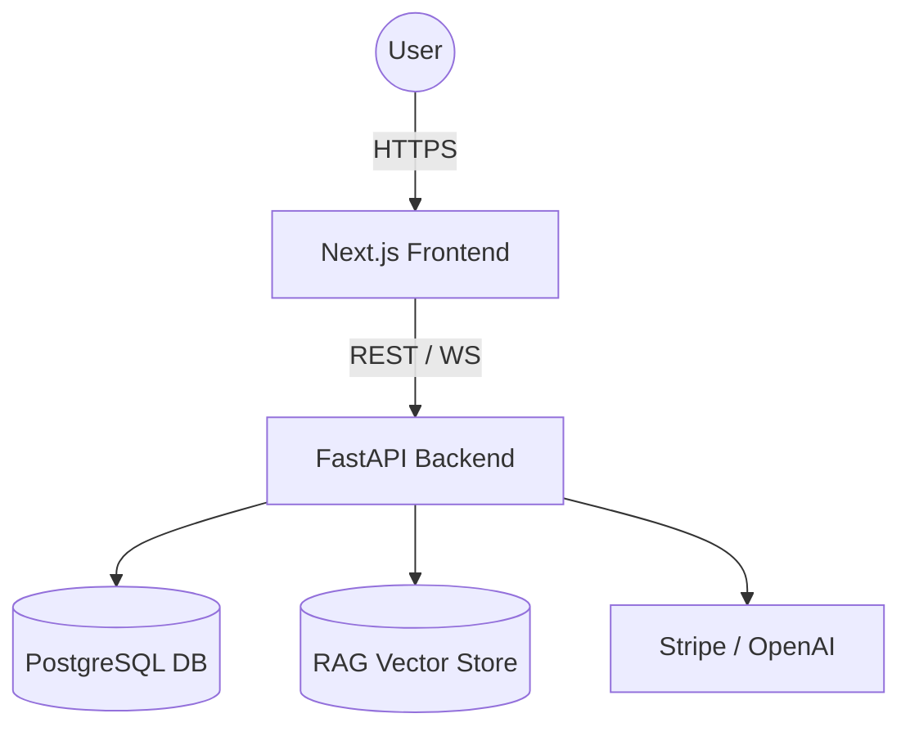

# SecureGuard AI – Next-Gen Cybersecurity SaaS 🛡️

SecureGuard AI is a high-performance, premium-grade SaaS platform designed to protect organizations from modern cyber threats. It features **real-time phishing defense**, a **unified security scanner**, a **RAG-powered AI Security Assistant**, and **interactive awareness training**.


---

## 🚀 Quick Start (Step-by-Step)

The fastest way to get SecureGuard running is using Docker. This starts the Frontend, Backend, and PostgreSQL database with a single command.


### 1. Prerequisites
- [Docker](https://www.docker.com/products/docker-desktop/) installed and running.
- [Git](https://git-scm.com/) installed.

### 2. Setup Guide
1.  **Clone the Repository**
    ```bash
    git clone https://github.com/NoorAhmed786/SecureGuard.git
    cd SecureGuard
    ```

2.  **Configure Environment**
    Copy the example environment file and customize it if needed (optional for local testing).
    ```bash
    cp .env.example .env
    ```

3.  **Launch the Application**
    ```bash
    docker-compose up --build
    ```

### 3. Access the Services
- **Frontend Dashboard**: [http://localhost:3000](http://localhost:3000)
- **API Documentation**: [http://localhost:8000/docs](http://localhost:8000/docs)

---

## 📸 Platform Showcase

### 🛡️ Dashboard & Security Scanner
A premium dashboard providing real-time metrics and a unified engine to analyze suspicious emails and websites.


### 🤖 AI Security Assistant (RAG)
An intelligent security companion that answers technical questions and analyzes threats using a proprietary knowledge base.


### 🚨 Real-time Alerts
Instant threat notifications ensure you never miss a critical security event.


### 👑 Admin Panel
A comprehensive administrative panel for managing users, API keys, and system settings.


---

## 🏗️ Architecture & Security

### High-Level Design
SecureGuard follows a **Layered Clean Architecture** to ensure scalability and security.



### 🛡️ Security & Code Quality
The project is continuously monitored by **SonarCloud** for vulnerabilities and code smells.

[](https://sonarcloud.io/dashboard?id=NoorAhmed786_SecureGuard)

- 📊 **[Live SonarCloud Report](https://sonarcloud.io/dashboard?id=NoorAhmed786_SecureGuard)**
- 🔒 **Zero-Secrets Policy**: Sensitive data is excluded via `.dockerignore` and `.gitignore`.
- 🔐 **Hardened Dockerfiles**: Optimized for security and minimal attack surface.

---

## 🛠️ Technical Details

### Tech Stack
| Component | Technology | Purpose |
| :--- | :--- | :--- |
| **Frontend** | Next.js 16, React 19, TypeScript | Modern SPA with SSR |
| **Backend** | Python 3.11, FastAPI, SQLAlchemy | High-performance async API |
| **Database** | PostgreSQL 15 | Persistent data storage |
| **AI/ML** | Scikit-learn, VectorStore | Phishing detection & RAG |

### 🧪 Testing
```bash
# Backend Tests
cd backend && python -m pytest tests/
# Frontend Linting
cd frontend && npm run lint
```

---

## ⚖️ Compliance & Audit
SecureGuard follows the **Microsoft SDL** and **STRIDE** methodology.
- **Threat Model**: [threat_model/secureguard_report.html](threat_model/secureguard_report.html)
- **Justification**: [threat_model/justification.md](threat_model/justification.md)

---

Licensed under the **MIT License**.
*Built for Security. Designed for Excellence.* 🛡️
