# SecureGuard AI – Next-Gen Cybersecurity SaaS 🛡️

SecureGuard AI is a high-performance, premium-grade SaaS platform designed to protect organizations from modern cyber threats. It features **real-time phishing defense**, a **unified security scanner**, a **RAG-powered AI Security Assistant**, and **interactive awareness training**.


Designed for **visual excellence**, **high-speed performance**, and **Clean Architecture**.

---

## 🏗️ System Architecture

This project follows a **Layered Clean Architecture** to ensure scalability, maintainability, and security.

### High-Level Architecture


### Component Breakdown
1.  **Frontend (Next.js 16 + React 19)**: Handles UI rendering, client-side routing, and connects to the backend via REST APIs and WebSockets. Hosted across `http://localhost:3000`.
2.  **Backend (FastAPI + Python 3.11)**: The core logic hub.
    -   **Auth**: JWT-based authentication.
    -   **Scanner**: Asynchronous email analysis using `scikit-learn`.
    -   **RAG**: Local vector search for security advisory.
3.  **Database (PostgreSQL 15)**: Persistent storage for users, scan logs, and subscriptions.
4.  **Orchestration**: Docker Compose manages the lifecycle of these services.

---

## 🛡️ Threat Modeling & Security Design

To assist with **Threat Modeling** (STRIDE/DREAD), we clearly define trust boundaries and assets.

### 1. Trust Boundaries

```mermaid
flowchart TB
    subgraph Internet ["Untrusted Zone (Internet)"]
        Attacker[("😈 Threat Actor")]
        User[("👤 Legitimate User")]
    end

    subgraph DMZ ["Demilitarized Zone (DMZ)"]
        Frontend["🖥️ Next.js Frontend"]
    end

    subgraph Trusted ["Trusted Internal Network"]
        Backend["🛡️ FastAPI Backend"]
        DB[("🗄️ PostgreSQL")]
        Vector[("🧠 RAG Vector Store")]
    end

    %% Data Flows
    User -->|HTTPS/TLS| Frontend
    Attacker -.->|DDoS / XSS / Injection| Frontend
    
    Frontend <-->|REST API / WSS Scanning| Backend
    
    Backend <-->|SQL| DB
    Backend <-->|Embeddings| Vector

    %% Trust Boundaries
    linkStyle 0,1 stroke:#00ff00,stroke-width:2px;
    linkStyle 2 stroke:#ff0000,stroke-width:2px,stroke-dasharray: 5 5;
    
    style Frontend fill:#e1f5fe,stroke:#01579b
    style Backend fill:#e8f5e9,stroke:#2e7d32
    style DB fill:#fff3e0,stroke:#ef6c00
```

*   **Boundary 1: Internet vs. Frontend**: The `Next.js` server exposes public endpoints. All inputs must be sanitized.
*   **Boundary 2: Frontend vs. Backend**: Communications occur over HTTP/WebSocket. The Backend treats the Frontend as an untrusted client (validates all tokens and payloads).
*   **Boundary 3: Backend vs. Database**: Secured via internal Docker network; credentials passed via environment variables.

### 2. Data Assets & Sensitivity
| Asset | Sensitivity | Storage | Protection |
| :--- | :--- | :--- | :--- |
| **User Credentials** | Critical | PostgreSQL (Users Table) | `bcrypt` Hashing |
| **Auth Tokens** | High | Client (LocalStorage/Cookie) | JWT (Signed) |
| **Phishing Reports** | Medium | PostgreSQL (Incidents) | Row-Level Access Control |
| **Payment Info** | Critical | Stripe (External) | Never stored locally (Tokenized) |

### 3. Key Security Controls
-   **Input Validation**: Pydantic schemas enforce type and format constraints on all API ingress points.
-   **Authentication**: OAuth2 with Password Flow (Bearer JWT).
-   **Secrets Management**: All secrets (`JWT_SECRET`, `STRIPE_KEY`) are loaded from `.env` and never hardcoded.

---

## 🚀 Quick Start (Dockerized)

The fastest way to get SecureGuard running is using Docker. This starts the Frontend, Backend, and PostgreSQL database with a single command.

### 1. Prerequisites
- [Docker](https://www.docker.com/products/docker-desktop/) installed and running.

### 2. Launch
```bash
# Clone the repository
git clone https://github.com/NoorAhmed786/SecureGuard.git
cd SecureGuard

# Prepare environment (Copy example and set SECRETS)
cp .env.example .env

# Start the entire stack
docker-compose up --build
```
> [!NOTE]
> - **Frontend**: [http://localhost:3000](http://localhost:3000)
> - **Backend (API Docs)**: [http://localhost:8000/docs](http://localhost:8000/docs)

---

## 📸 Platform Showcase

### 🖥️ Dashboard & Command Center
A premium dashboard providing real-time metrics, threat visualizations, and actionable insights.


### 🛡️ Unified Security Scanner
Analyze suspicious emails for phishing and scan public-facing websites for vulnerabilities.


### 🤖 AI Security Assistant (RAG)
An intelligent security companion that can answer technical questions and analyze threats based on a proprietary knowledge base.


### 🚨 Real-time Alerts
Instant notifications delivered to the Dashboard whenever a threat is detected.


### 🎓 Cybersecurity Awareness Training
Interactive courses to educate employees about modern security threats.


### 🔌 Edge Protection Widget
Lightweight JavaScript snippet to protect client websites at the edge.


### 💳 Subscription & Payments
Stripe-integrated billing for seamless enterprise scaling.


---

## 🏛️ Technical Implementation Details

This project is strictly structured around **SOLID principles** and **Clean Architecture**.

### Architecture Layers
- **Application Layer**: Business use cases and REST API routers (FastAPI).
- **Infrastructure Layer**: Technical implementations—PostgreSQL (SQLAlchemy), Stripe, AI Providers, and Security Scanners.
- **Domain Layer**: Core business entities and logic (Pydantic schemas/models).

### Tech Stack
| Component | Technology | Purpose |
| :--- | :--- | :--- |
| **Backend** | Python 3.11, FastAPI, SQLAlchemy | High-performance async API |
| **Frontend** | Next.js 16, React 19, TypeScript | Modern SPA with SSR |
| **Database** | PostgreSQL 15 | Persistent data storage |
| **UI/UX** | Tailwind CSS, Framer Motion | Premium, fluid animations |
| **AI/ML** | Scikit-learn, VectorStore | Phishing detection & RAG |

---

## 🛠️ Manual Developer Setup

If you prefer to run services locally without Docker:

### 1. Backend Setup
```bash
cd backend
python -m venv venv
# Windows: .\venv\Scripts\activate | Linux: source venv/bin/activate
pip install -r requirements.txt
# Start the server
python -m uvicorn app.main:app --host 127.0.0.1 --port 8000 --reload

# (Required for first run) Seed the database
python scripts/seed.py
```

### 2. Frontend Setup
```bash
cd frontend
npm install
npm run dev
```

---

## 🧪 Testing & Reliability

SecureGuard includes a robust testing suite to ensure stability during development.

### Backend Tests
We use `pytest` for unit and integration testing.
```bash
cd backend
python -m pytest tests/
```

### CI/CD Integration
All tests are automatically executed by GitHub Actions on every push to the `main` branch.

---

## 🔄 CI/CD Pipeline

The project uses **GitHub Actions** for continuous integration and delivery. The pipeline is defined in `.github/workflows/main.yml`.

### Workflow Stages
1.  **Backend Quality**:
    - Installs Python dependencies.
    - Runs `ruff` for fast linting.
    - Runs `pytest` for automated business logic verification.
2.  **Frontend Quality**:
    - Installs Node.js dependencies.
    - Runs `npm run lint` (ESLint) to ensure type safety.
3.  **Build & Publish**:
    - **Trigger**: Only on push to `main` branch.
    - Builds production-ready Docker images for Frontend and Backend.
    - Pushes images to **GitHub Container Registry (GHCR)**.

### 🚀 How to Run
The pipeline is **automatic**. To trigger a full build and deployment:
```bash
git add .
git commit -m "feat: your amazing change"
git push origin main
```
Monitor the progress in the **Actions** tab of your GitHub repository.

### ☁️ Cloud Deployment (Recommended)
SecureGuard is optimized for modern cloud hosting:
- **Frontend**: Seamlessly deploy to **Vercel** via the `frontend/` directory.
- **Backend**: Optimized for **Railway.app** or **Render** using the provided `Procfile`.

> [!TIP]
> See the [Full Deployment Guide](docs/deployment.md) for step-by-step cloud setup.

> [!IMPORTANT]
> Ensure all linting checks pass locally before pushing code.
> - **Backend**: `cd backend && ruff check .`
> - **Frontend**: `cd frontend && npm run lint`

### ✅ Project Verification Checks
The following checks were implemented and passed to ensure a robust deployment:
| Component | Check Type | Tool | Command | Status |
| :--- | :--- | :--- | :--- | :--- |
| **Backend** | Linting & Style | `ruff` | `ruff check .` | ✅ Passed |
| **Backend** | Unit Testing | `pytest` | `pytest tests/` | ✅ Passed |
| **Frontend** | Static Analysis | `ESLint` | `npm run lint` | ✅ Passed |
| **Frontend** | Compilation | `Next.js` | `npm run build` | ✅ Passed |
| **Build** | Orchestration | `Docker` | `docker-compose build` | ✅ Optimized |
| **Security** | Zero-Secrets | `Custom` | `.env` Injection | ✅ Verified |
| **Cloud** | Quality Gate | `SonarCloud` | `Automatic Analysis` | ✅ A+ Grade |

---

## 📂 Project Structure
```text
SecureGuard/
├── backend/            # FastAPI source code & Dockerfile
│   ├── scripts/        # Backend-specific scripts (seeding, logic)
│   └── tests/          # Automated test suite (pytest)
├── frontend/           # Next.js source code & Dockerfile
├── docs/               # System architecture & API documentation
├── threat_model/       # Assignment: STRIDE Threat Model & HTML Report
├── scripts/            # Global utility scripts
├── screenshots/        # UI showcase assets
├── docker-compose.yml  # Multi-container orchestration
├── sonar-project.properties # SonarCloud configuration
└── README.md           # This file
```

---

## ⚖️ Compliance & Audit (Assignment)

We maintain a rigorous security documentation standard following the **Microsoft SDL** and **STRIDE** methodology.

- **Threat Model**: [threat_model/secureguard_report.html](threat_model/secureguard_report.html)
- **Justification Rationale**: [threat_model/justification.md](threat_model/justification.md)
- **Data Source**: [threat_model/secureguard.tm](threat_model/secureguard.tm)

---

## 📸 Final UI Reference
Built with a professional dark theme, glassmorphism, and smooth animations.


---

## ⚖️ License
Licensed under the **MIT License**.

*Built for Security. Designed for Excellence.* 🛡️
