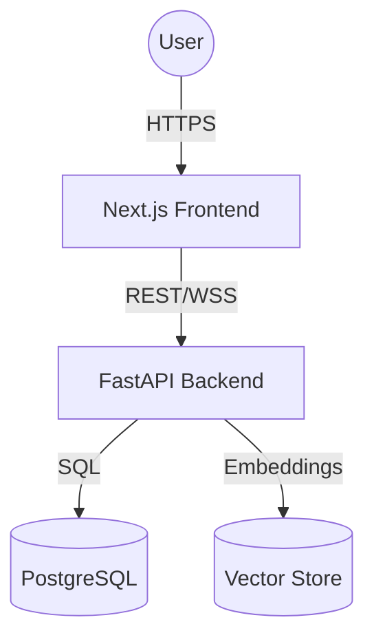

# System Architecture

## Overview
SecureGuard follows a **Layered Clean Architecture** to distinguish between the domain logic, application use cases, and infrastructure details.

## High-Level Diagram

## Layers
1.  **Domain Layer**: Contains enterprise logic and types (Pydantic models). It is independent of other layers.
2.  **Application Layer**: Orchestrates business use cases (e.g., `AnalyzeEmail`, `ProcessPayment`).
3.  **Infrastructure Layer**: Implements interfaces for external tools (Stripe, OpenAI, SQL DB).
4.  **Presentation Layer**: The API routers and WebSocket endpoints.
